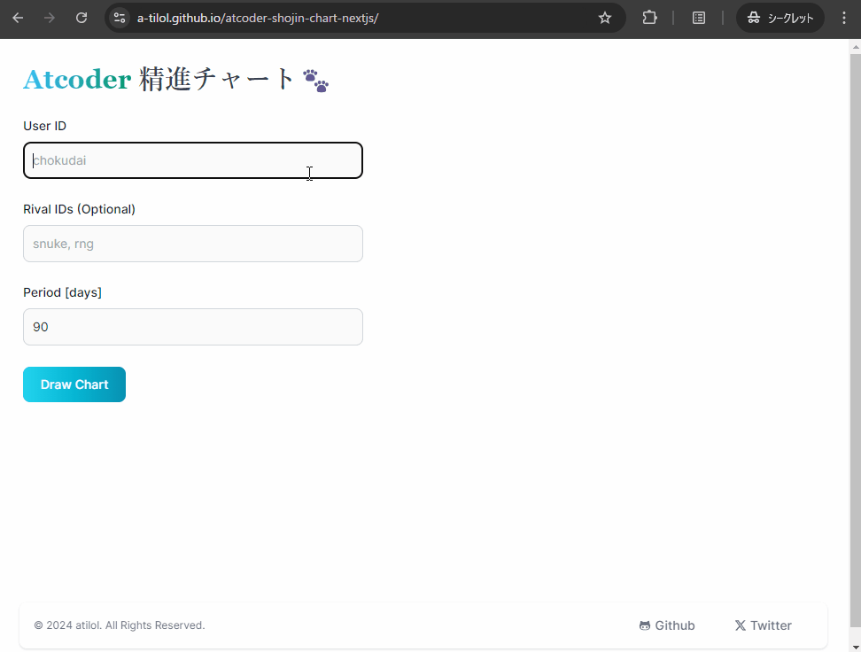

# AtCoder 精進チャート🐾

自分とライバルの精進量の比較ができます。 ライバルと競争してモチベーションを高めましょう！

Website [https://a-tilol.github.io/atcoder-shojin-chart-nextjs/](https://a-tilol.github.io/atcoder-shojin-chart-nextjs/)

## 効能（あったらいいな）

- 実力の近いライバルと競争することでモチベーションが高まります！
- ねこからの応援メッセージにより自己肯定感が上がります！

## 注意点

※[kenkooooさんのAPI](https://github.com/kenkoooo/AtCoderProblems/blob/master/doc/api.md)を使わせていただいています。ありがとうございます。過度なリクエストは避け感謝しながら使用してください。本サイトでは1リクエストにつき1秒のスリープを入れています。

※リクエスト制限のためライバルが多い場合や表示期間が長い場合はチャートの表示に時間がかかります。
